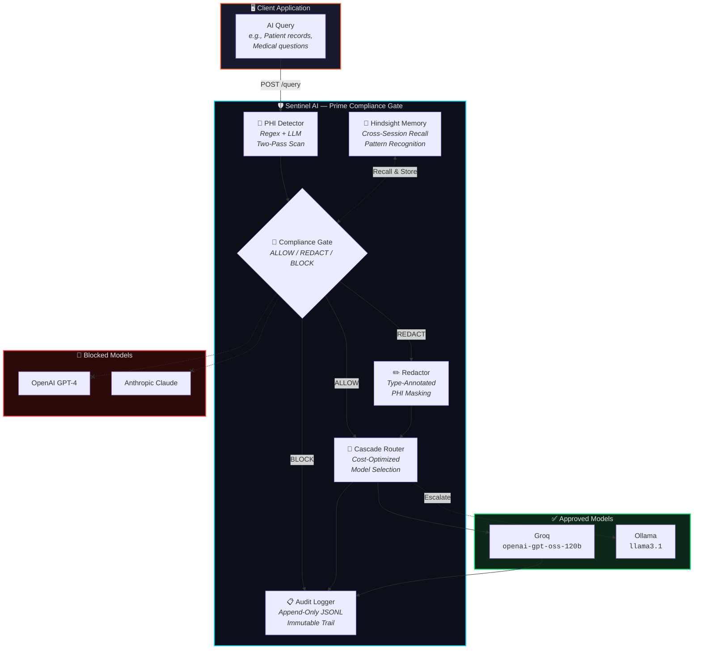
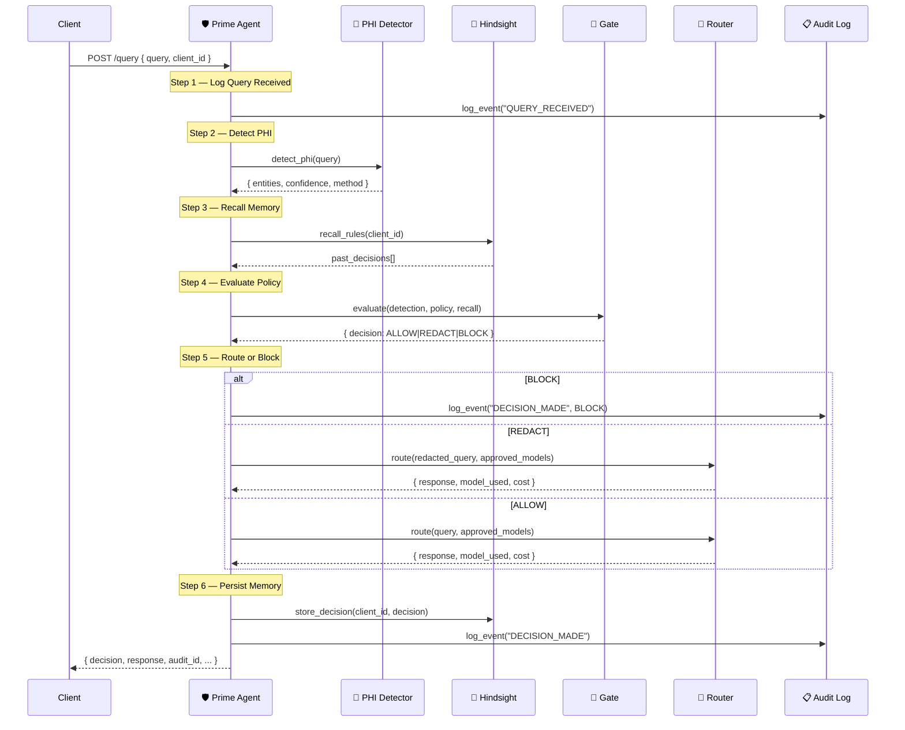
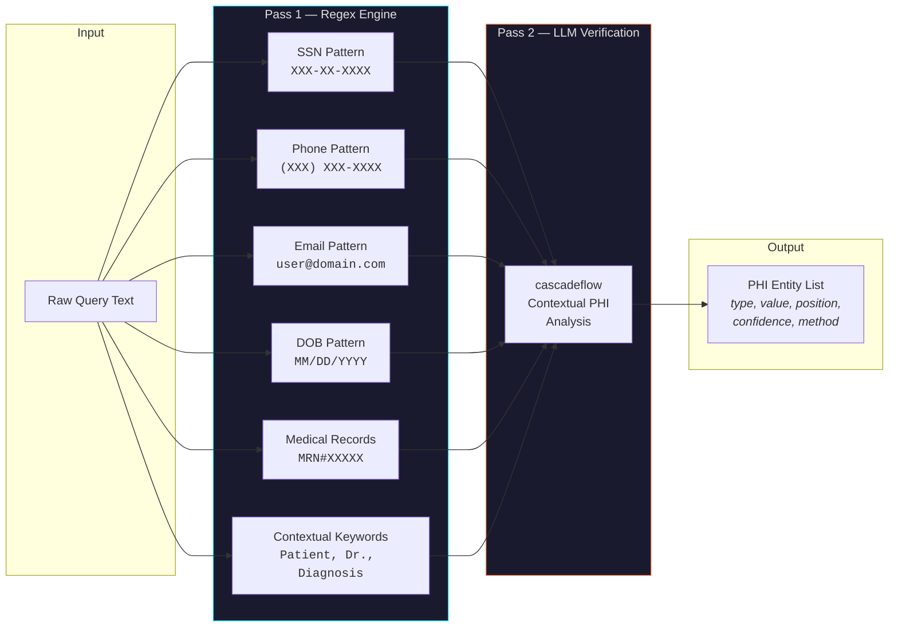
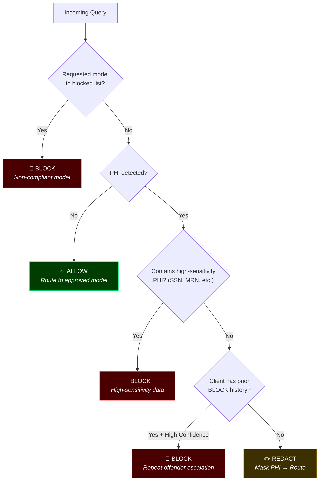
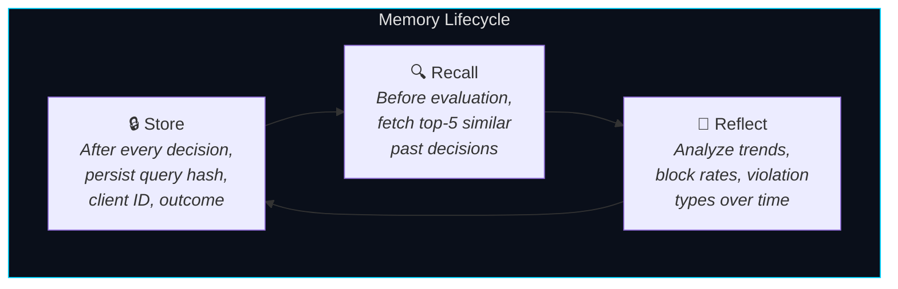

<p align="center">
  
  
  
  
  
</p>

<h1 align="center">🛡️ Sentinel AI</h1>
<h3 align="center">Compliance Infrastructure for AI Agents</h3>

<p align="center">
  <strong>Powered by Prime</strong> — the compliance gate agent that intercepts every AI query,<br/>
  detects regulated data in real-time, and routes only to approved models.
</p>

<p align="center">
  <a href="#-quick-start">Quick Start</a> •
  <a href="#-architecture">Architecture</a> •
  <a href="#-how-it-works">How It Works</a> •
  <a href="#-api-reference">API Reference</a> •
  <a href="#-demo-scenarios">Demo Scenarios</a>
</p>
<h2 align="center" >## 🚀 Live Demo </h2>

<h1 align="center"> **Application:** https://sentinal-ai-a8ig.onrender.com/ </h1>

---

## 🔍 Problem Statement

Production AI systems regularly handle sensitive data — patient records, financial information, and personally identifiable information. Most AI pipelines send this data **directly to third-party models** with:

- ❌ No compliance checks
- ❌ No audit trail
- ❌ No memory of past violations
- ❌ No control over which models access your data

This creates regulatory risk under **HIPAA**, **GDPR**, **PCI-DSS**, and other frameworks.

## 💡 Solution

**Sentinel AI** places an intelligent compliance gate between your application and AI models. Every query is scanned for regulated data, every decision is logged to an immutable audit trail, and only policy-approved models ever receive your data. Prime — the core agent — remembers past decisions across sessions using [Hindsight](https://github.com/vectorize-io/hindsight), enabling adaptive enforcement that learns from your organization's compliance patterns over time.

---

## 🏗️ Architecture

### High-Level System Architecture



### Prime Agent — Internal Pipeline



### PHI Detection — Two-Pass Engine



### Gate Decision Logic



---

## 🚀 Quick Start

### Prerequisites

| Requirement | Version |
|------------|---------|
| Python | ≥ 3.11 |
| pip | Latest |
| Git | Latest |

### 1. Clone the Repository

```bash
git clone https://github.com/YOUR_USERNAME/sentinel-ai.git
cd sentinel-ai
```

### 2. Install Dependencies

```bash
pip install -r requirements.txt
```

### 3. Configure Environment

```bash
cp .env.example .env
```

Edit `.env` with your API keys:

```env
# Required — LLM Provider
GROQ_API_KEY=your_groq_api_key_here

# Optional — Cross-Session Memory
HINDSIGHT_API_KEY=your_hindsight_api_key_here
HINDSIGHT_BASE_URL=https://api.hindsight.vectorize.io

# Optional — Local Fallback Model
OLLAMA_BASE_URL=http://localhost:11434/v1
```

> **Note:** Sentinel AI works without any API keys — it gracefully degrades to simulated responses for LLM routing and in-memory storage for Hindsight. This is perfect for development and testing.

### 4. Run the Server

```bash
uvicorn sentinel_ai.main:app --reload --port 8000
```

Or with **Docker**:

```bash
docker-compose up
```

### 5. Open the Dashboard

Visit **http://localhost:8000** in your browser to access the interactive Prime Dashboard.

| Resource | URL |
|----------|-----|
| 🖥️ Dashboard UI | http://localhost:8000 |
| ❤️ Health Check | http://localhost:8000/health |
| 🎬 Demo Scenarios | http://localhost:8000/demo |

---

## ⚙️ How It Works

### Key Integrations

| Integration | Purpose | Fallback |
|------------|---------|----------|
| [**Hindsight**](https://github.com/vectorize-io/hindsight) | Persistent cross-session memory for compliance decisions | In-memory store (no cross-session persistence) |
| [**cascadeflow**](https://pypi.org/project/cascadeflow/) | Intelligent model routing with automatic escalation | Simulated responses with routing decision explanation |
| [**Groq**](https://groq.com/) | Ultra-fast inference for approved LLM models | Offline mode with compliance-only operation |

### Hindsight Memory — How Prime Remembers



1. **Store** — After every compliance decision, Prime stores the query hash, decision type, client ID, and outcome metadata in Hindsight's vector store.
2. **Recall** — Before evaluating a new query, Prime recalls the top-5 most relevant past decisions for the same client, enabling escalation for repeat offenders and pattern recognition.
3. **Reflect** — The `reflect()` method analyzes accumulated decisions to surface trends — block rates, common violation types, and compliance improvements over time.

### cascadeflow Routing — Cost-Optimized Model Selection

1. **Policy Enforcement** — Only models listed in `approved_models` are available. Blocked models are never called.
2. **Cost Optimization** — Queries route to the cheapest approved model first (`groq/openai-gpt-oss-120b`).
3. **Automatic Escalation** — If the primary model returns an empty or low-quality response, cascadeflow escalates to the fallback model (`ollama/llama3.1`).
4. **Redaction Pipeline** — For REDACT decisions, PHI is masked with typed placeholders (`[REDACTED-SSN]`, `[REDACTED-DIAGNOSIS]`) before any model sees the data.

---

## 🎯 Demo Scenarios

Sentinel AI ships with three built-in scenarios that exercise the Prime compliance gate across different risk levels.

### Run via CLI

```bash
python -m sentinel_ai.scenarios
```

### Run via API

```bash
curl http://localhost:8000/demo
```

---

### Scenario 1: 🚫 Block PHI — SSN + Diagnosis + Name

**Input:**
```
Patient John Smith (SSN: 123-45-6789) was diagnosed with Type 2 Diabetes
on 03/15/2024. His treating physician Dr. Sarah Johnson prescribed
Metformin 500mg twice daily.
```

| Field | Value |
|-------|-------|
| PHI Detected | ✅ Yes (10 entities) |
| Decision | **🚫 BLOCK** |
| Reason | Query contains high-sensitivity PHI (SSN) |
| Model Used | `none` |

---

### Scenario 2: ✏️ Redact Medical — Diagnosis + Doctor Name

**Input:**
```
Dr. Emily Chen noted that the patient presents with symptoms consistent
with Major Depressive Disorder. The patient has been experiencing fatigue,
loss of appetite, and insomnia for the past three months.
```

| Field | Value |
|-------|-------|
| PHI Detected | ✅ Yes (3 entities) |
| Decision | **✏️ REDACT** |
| Reason | PHI eligible for redaction; mask strategy applied |
| Model Used | `groq/openai-gpt-oss-120b` |

---

### Scenario 3: ⚔️ Attack — Non-Compliant Model Request

**Input:**
```
What are the common side effects of Lisinopril?
```
*With `requested_model: "openai/gpt-4"` (blocked model)*

| Field | Value |
|-------|-------|
| Decision | **🚫 BLOCK** |
| Reason | Requested model 'openai/gpt-4' is not approved under HIPAA |
| Blocked Model | `openai/gpt-4` |

---

## 📡 API Reference

### Core Endpoints

| Method | Endpoint | Description |
|--------|----------|-------------|
| `POST` | `/query` | Process a query through the Prime compliance gate |
| `POST` | `/chat` | Send a message to the Support FAQ agent |
| `GET` | `/demo` | Run all 3 demo scenarios |
| `GET` | `/health` | System health check |
| `GET` | `/` | Interactive Prime Dashboard UI |

### Audit Endpoints

| Method | Endpoint | Description |
|--------|----------|-------------|
| `GET` | `/audit/recent?limit=20` | Get recent audit log entries |
| `GET` | `/audit/client/{client_id}` | Get audit entries for a specific client |
| `GET` | `/audit/stats` | Get aggregate audit statistics |

### Example: Process a Query

```bash
curl -X POST http://localhost:8000/query \
  -H "Content-Type: application/json" \
  -d '{
    "client_id": "my-app-001",
    "query": "What are the side effects of Metformin?",
    "requested_model": "groq/openai-gpt-oss-120b"
  }'
```

**Response:**

```json
{
  "decision": "ALLOW",
  "reason": "No protected health information detected in the query.",
  "response": "Metformin side effects include...",
  "model_used": "groq/openai-gpt-oss-120b",
  "cost": 0.001,
  "latency_ms": 245.67,
  "audit_id": "f5038df1-3a08-4f9b-9988-f95cf0bb0fde",
  "phi_detected": false,
  "entity_count": 0,
  "detection_method": "regex",
  "redacted": false,
  "escalated": false
}
```

---

## 📋 Audit Trail

Every compliance decision is logged to an **append-only JSONL** file (`audit.log`). Entries are **never overwritten or deleted**.

### Audit Entry Format

```json
{
  "audit_id": "f5038df1-3a08-4f9b-9988-f95cf0bb0fde",
  "timestamp": "2025-01-15T10:30:00.150000+00:00",
  "event": "DECISION_MADE",
  "agent": "Prime",
  "project": "Sentinel AI",
  "client_id": "hospital-emr-001",
  "query_hash": "98ac1f09b938...",
  "decision": "BLOCK",
  "reason": "Query contains high-sensitivity PHI (ssn).",
  "model_used": "none",
  "cost": 0.0,
  "latency_ms": 7.84,
  "entity_count": 10,
  "redacted": false
}
```

### Audit Locations

| Output | Details |
|--------|---------|
| **File** | `audit.log` in project root (configurable via `AUDIT_LOG_PATH`) |
| **stdout** | All entries printed to stdout for live monitoring |
| **API** | Query via `/audit/recent`, `/audit/client/{id}`, `/audit/stats` |
| **Sample** | See `examples/sample_audit_log.jsonl` |

---

## 📁 Project Structure

```
sentinel-ai/
├── 📄 README.md                     ← You are here
├── 📄 pyproject.toml                ← Package config, dependencies, metadata
├── 📄 requirements.txt             ← Pinned dependency versions
├── 📄 Dockerfile                   ← Multi-stage production container
├── 📄 docker-compose.yml           ← One-command deployment
├── 📄 .env.example                 ← Environment variable template
├── 📄 .gitignore                   ← Git exclusion rules
│
├── 📂 sentinel_ai/                  ← Core Python package
│   ├── __init__.py                  ← Package metadata (version, agent name)
│   ├── main.py                      ← FastAPI application & all REST endpoints
│   ├── prime.py                     ← Prime agent — orchestrates full pipeline
│   ├── detector.py                  ← PHI/PII detection (regex + LLM two-pass)
│   ├── gate.py                      ← Compliance decision engine (ALLOW/REDACT/BLOCK)
│   ├── router.py                    ← Model routing via cascadeflow
│   ├── memory.py                    ← Hindsight memory integration + fallback store
│   ├── audit.py                     ← Append-only JSONL audit logger
│   ├── redact.py                    ← PHI redaction with typed placeholders
│   ├── scenarios.py                 ← Built-in demo scenarios (3 test cases)
│   └── config.py                    ← Configuration loader (env + policy file)
│
├── 📂 policies/                     ← Compliance policy definitions
│   └── hipaa.json                   ← HIPAA policy (PHI types, approved models, thresholds)
│
├── 📂 static/                       ← Frontend assets
│   └── index.html                   ← Interactive Prime Dashboard (single-page app)
│
├── 📂 tests/                        ← Test suite (pytest)
│   ├── test_detector.py             ← PHI detection tests
│   ├── test_gate.py                 ← Gate decision logic tests
│   ├── test_router.py               ← Model routing tests
│   └── test_e2e.py                  ← End-to-end integration tests
│
└── 📂 examples/                     ← Sample data for reference
    ├── sample_audit_log.jsonl       ← Example audit log entries
    ├── sample_query_allowed.json    ← Example allowed query payload
    └── sample_query_blocked.json    ← Example blocked query payload
```

---

## 🧪 Testing

Run the full test suite:

```bash
pytest -v
```

Run specific test modules:

```bash
# PHI detection tests
pytest tests/test_detector.py -v

# Gate decision logic tests
pytest tests/test_gate.py -v

# Model routing tests
pytest tests/test_router.py -v

# End-to-end integration tests
pytest tests/test_e2e.py -v
```

---

## 🐳 Docker Deployment

### Build and Run

```bash
docker-compose up --build
```

### Container Features

- **Multi-stage build** for minimal image size
- **Non-root user** (`sentinel`) for security
- **Health checks** every 30 seconds
- **Volume mounts** for `audit.log` persistence and policy files
- **Environment injection** via `.env` file

### Environment Variables

| Variable | Default | Description |
|----------|---------|-------------|
| `GROQ_API_KEY` | — | Groq API key for LLM inference |
| `HINDSIGHT_API_KEY` | — | Hindsight API key for cross-session memory |
| `HINDSIGHT_BASE_URL` | `https://api.hindsight.vectorize.io` | Hindsight server URL |
| `HINDSIGHT_BANK_ID` | `client_id` | Memory bank identifier |
| `HINDSIGHT_ENABLED` | `true` | Enable/disable Hindsight integration |
| `OLLAMA_BASE_URL` | `http://localhost:11434/v1` | Ollama server URL for fallback model |
| `POLICY_FILE` | `policies/hipaa.json` | Path to compliance policy file |
| `AUDIT_LOG_PATH` | `audit.log` | Path to the audit log file |
| `LOG_LEVEL` | `INFO` | Logging verbosity |
| `HOST` | `0.0.0.0` | Server bind address |
| `PORT` | `8000` | Server port |

---

## 🗺️ Roadmap

- [ ] **Multi-framework support** — Add GDPR, SOC 2, and PCI-DSS policy templates
- [ ] **Webhook alerts** — Notify security teams on BLOCK decisions
- [ ] **Client-specific policies** — Per-client policy overrides
- [ ] **Model quality scoring** — Track and compare model response quality
- [ ] **Batch processing** — Support for bulk query compliance checking
- [ ] **Advanced PHI detection** — Fine-tuned NER model for medical entities
- [ ] **Rate limiting** — Per-client query rate limits with compliance tiers
- [ ] **RBAC** — Role-based access control for API endpoints

---

## 🤝 Contributing

1. **Fork** the repository
2. **Create** a feature branch: `git checkout -b feature/my-feature`
3. **Commit** your changes: `git commit -m "Add my feature"`
4. **Push** to the branch: `git push origin feature/my-feature`
5. **Open** a Pull Request

---

## 📜 License

This project is licensed under the **MIT License**. See [LICENSE](LICENSE) for details.

---

<p align="center">
  <strong>Sentinel AI</strong> — Because compliance shouldn't be an afterthought.<br/>
  Powered by <strong>Prime</strong>, the compliance gate agent.
</p>
